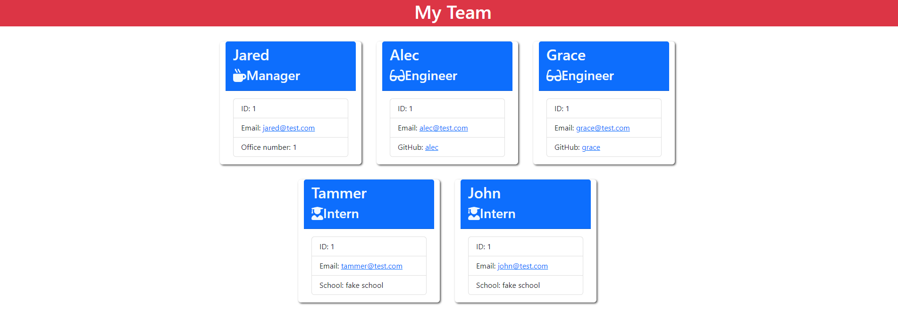

# Team Profile Generator

## Description

This app will let users to generate team with Manager, Engineers, and Inters. Each position will have unique information of user's prompt.

## Demo
Link to Demo Video: <a href="https://drive.google.com/file/d/1MUp8fNP-aReEmrXYl8OiXvg1Ihl2eMoN/view"> Link to google drive video</a>

## Screenshot
Below is picture of when test is done running. 

Below is picture of terminal when done creating teams. 

Below is what generated Team website looks like. 

## Tech Used

## Installation
In order to utilize this application, user have to install node.js,
and in addition to node.js, need to install inquirer.js(8.2.4) and Jest. It's done when user types "node i" into the terminal.

## License

N/A

## Contact

<ul>
    <li><b>Email: </b> <a href="connorcho22@gmail.com">connorcho22@gmail.com</a></li>
    <li><b>Github: </b> <a href="https://github.com/connorcho66">connorcho66</a></li>
    <li><b>Linked In: </b> <a href="www.linkedin.com/in/seongyun-cho-89a8a61a0">SeongYun Cho</a></li>
</ul>